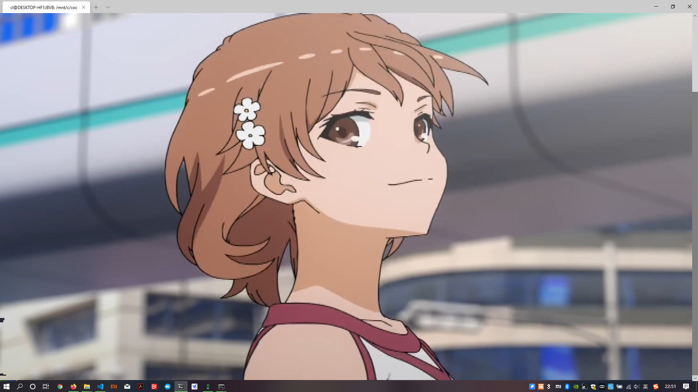

# 命令行播放视频

需要支持真彩色的控制台。使用方法：比如说Windows Terminal
```bash
python3 videoplay.py test.mp4
```
不过即使删掉了一部分帧数，速度依然很慢，基本不可能按照原来的速度播放。这是一个示例[https://www.bilibili.com/video/av85487336](https://www.bilibili.com/video/av85487336)

另外，附带一个命令行显示图片的。你把控制台的字体设置的足够小（很多情况下，用快捷键`Ctrl+-`就可以缩小字体），其实还是挺清晰的。
```bash
python3 imshow.py test.png
```
比如这是在`WSL`中显示出来的炮姐图片（左边界有些瑕疵，我也不知道为什么）

